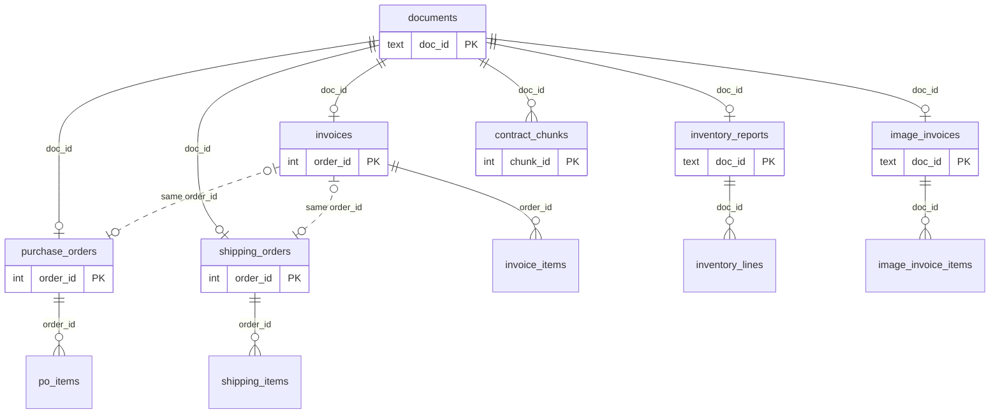

# Procurement Knowledge Base — Technical Overview

A local data pipeline and MCP server that let an AI agent retrieve, compare and
reason across a heterogeneous procurement knowledge base — invoices, purchase
orders, shipping orders, inventory reports and a supply contract — with answers
grounded in source references.

**Miguel Ángel Santana Hernández** · Senior AI Data Software Developer · June 2026

> **The design in one line.** The data has two shapes, so retrieval has two shapes.
> The transactional records (invoices, POs, shipping, inventory) are relational and
> join on an `order_id`, so they are answered with deterministic SQL. The single
> narrative document (the contract) is the only thing embedded for semantic search.
> The MCP client is the agent; the server is a grounded, auditable tool layer.

**How to read this document (top-down).** It widens from idea to implementation:
Part I — the system at a glance; Part II — the data; Part III — retrieval & the MCP
surface; Part IV — the repository (layout, dependencies, what was left out, how to
run, validation). An `.html` version with rendered diagrams is in
[`technical-overview.html`](technical-overview.html).

---

# Part I — The system at a glance

## 1. What this is, and the problem it solves

The brief provides a small procurement knowledge base — 45 files across five
categories (invoices, purchase orders, shipping orders, inventory reports,
contracts) — as a mix of clean PDFs, a long contract, and scanned image invoices.
The task is a **local** pipeline that prepares those files plus an **MCP server**
that lets an AI agent (Claude Desktop, ChatGPT, any MCP client) ask questions over
them and answer with citations.

The interesting part is not parsing files; it is the architecture. Looking at the
example questions, seven of the eight are **relational** — "which invoices are
missing a purchase order", "which documents support order 10687", "are there
mismatches between invoice, PO and shipping". Only one is genuinely **semantic** —
"summarize the contract terms relevant to supply of goods". So the obvious move,
"embed every document into a vector store", would be the wrong architecture: vector
similarity cannot prove a row is *absent*, and it cannot guarantee an exact lookup.
The design follows the data instead.

## 2. Architecture overview

Three layers, one database, no external services. A **pipeline** prepares the files
into a single SQLite database (relational tables + a keyword index + the contract
vectors). A **FastMCP server** exposes six typed tools over those tables. The **MCP
client** does the reasoning and calls the tools. For 45 documents, one ~2 MB file
and one process is the right amount of machinery.

```
            data/ (45 files, 3 shapes)
   ┌─────────────────────┬──────────────────────┬─────────────────────────┐
   │ Northwind PDFs      │ Contract (71p)       │ 5 image invoices (JPG)  │
   │ structured + semi   │ unstructured         │ multi-modal             │
   └─────────┬───────────┴───────────┬──────────┴────────────┬────────────┘
             │ pdfplumber            │ PyMuPDF                │ Claude vision
             │ deterministic parse   │ text + colors (no OCR) │ tolerant schema (cached)
             ▼                       ▼                        ▼
   ┌──────────────────────────────────────────────────────────────────────┐
   │  procurement.db  (SQLite, one file)                                    │
   │   relational tables (join on order_id) · documents (lineage)           │
   │   doc_fts / contract_fts (BM25) · contract_vec (sqlite-vec, 384-d)     │
   └───────────────────────────────────┬──────────────────────────────────┘
                                        │  read-only
                                        ▼
   ┌──────────────────────────────────────────────────────────────────────┐
   │  FastMCP server  — 6 typed tools, each returns SourceRefs              │
   │   search · get_document · get_order_dossier · reconcile ·              │
   │   search_contract · list_inventory_reports                            │
   └───────────────────────────────────┬──────────────────────────────────┘
                                        │  MCP (stdio, JSON-RPC)
                                        ▼
                 Claude Desktop / ChatGPT  ← the agent routes between tools
```

**Key technologies:** Python (managed with `uv`) · SQLite + `sqlite-vec` · FTS5 ·
`fastembed` (bge-small-en-v1.5, 384-d) · `pdfplumber` · PyMuPDF · Anthropic vision ·
the official MCP SDK (FastMCP). Eight direct dependencies, no GPU, no torch, no
external services — detailed in §12.

## 3. How an AI agent uses it (interaction flow)

This is what makes it an *agentic* system rather than a search box. The
orchestration is not hard-coded; the MCP client is the agent, and it decides what
to call.

1. The user asks a natural-language question in the client (e.g. Claude Desktop).
2. The client reads the tool descriptions and **typed schemas** the server
   advertises, and picks the tool whose contract matches the question. For "missing
   a PO" it picks `reconcile`; for the contract it picks `search_contract`.
3. It calls the tool over stdio (JSON-RPC). The server runs a read-only query and
   returns `structuredContent` — a validated object, not prose — including
   `SourceRef`s.
4. The client may chain tools (e.g. `get_order_dossier` → `get_document`), then
   composes the final answer and cites the sources.

The server stays a deterministic capability layer — there is no second agent loop
inside it. The design lever is the **tool surface**: name and type the tools well,
and the right one becomes the obvious choice for the model.

---

# Part II — The data

## 4. The data: three shapes

Before any code, the files sort into three shapes, and the whole architecture
follows from that reading:

| Shape | Files | Nature | Consequence |
|---|---|---|---|
| **Transactional records** | invoices, POs, shipping, inventory (Northwind PDFs) | structured/semi, consistent templates, keyed by `order_id` | parse deterministically → relational tables → SQL |
| **One narrative document** | the 71-page supply contract (digital PDF) | unstructured legal prose | chunk + embed → the only thing in the vector index |
| **Scanned image invoices** | 5 JPGs (two visibly different layouts) | multi-modal, heterogeneous, a different vendor schema | vision-LLM extraction → a separate, tolerant schema |

Two findings inside the data shaped specific decisions: the image invoices are not
even one schema among themselves (§7), and the contract is a blank *template* whose
highlight colors carry meaning (§8).

## 5. Data flow (the pipeline)

One re-runnable pipeline (`python -m procurement_kb.pipeline.run`) walks `data/` and
builds `procurement.db` in five steps:

1. **Register** — every file is recorded in `documents` (SHA-256, category, file
   type, page count) so every later record has lineage back to a source file.
2. **Route by shape** — clean Northwind PDFs to deterministic parsers; the 5 image
   invoices to the vision model; the contract to PyMuPDF.
3. **Extract** — structured fields and line items for the records; text +
   highlight-color metadata for the contract; a tolerant structured object per image.
4. **Index** — records into relational tables and a keyword index (`doc_fts`, BM25);
   contract chunks into `contract_fts` (BM25) + `contract_vec` (384-d vectors).
5. **Serve** — the MCP server runs read-only queries behind six tools. The MCP layer
   consumes *processed* data; it never extracts at request time.

**Reproducible & re-runnable.** The database is dropped and rebuilt (child tables
before parents, so foreign-key checks pass on a re-run over a populated DB) each run,
so row counts are stable (idempotent). Only the non-deterministic vision step is cached
— by content hash of the image bytes — so the deterministic parsers always run fresh,
while the whole pipeline still runs **offline with no API key** (the 5 extractions ship
pre-computed in `cache/`). Because the cache key is the image's content hash, a re-run
re-extracts **only** images that are new or changed (cache miss → one Claude-vision
call each); unchanged images are served from `cache/` with no API call. Dependencies are
pinned with `uv.lock`. The vision extraction is forced through a structured tool call, so
its output always conforms to the schema and can be safely cached.

**Seeing a data change in the client.** The MCP server reads only `procurement.db` —
never `data/` or `cache/` directly. So after you add, change, or remove a file in
`data/`, **re-run the pipeline** to rebuild `procurement.db`; the client then reflects it
on its **next** tool call automatically — no Claude Desktop restart needed. (Editing
`cache/` alone changes nothing the client sees; the cache is only an input to the
pipeline.) Restart Claude Desktop **only** when you change the server code or the config,
which it reads at startup.

## 6. Data modeling choices

`order_id` is the foreign key of the transactional graph: `invoices`,
`purchase_orders` and `shipping_orders` all join on it; `inventory_reports` join on
period and category, not on an order. Each order table has its own 1—N line-item
child table. A `documents` table is the lineage registry, so every record maps back
to a source file and page.

The five image invoices are modeled as a **separate schema** (`image_invoices`):
they carry no `order_id` and are never joined to the order graph, because they
genuinely are not related — different vendors, different layouts. Forcing them into
the order graph would manufacture false matches; keeping them as their own island is
the honest model. The contract is stored as `contract_chunks` with a `highlight`
column derived from its template colors (§8).



Everything hangs off `documents` (lineage). `invoices`, `purchase_orders` and
`shipping_orders` share the same `order_id` — the graph that joins, anti-joins and
reconciles. `image_invoices` and `contract_chunks` have no `order_id`: the islands
that never join the order graph. (Full column-level schema in `procurement_kb/db.py`.)

## 7. Structured extraction vs document retrieval

A central decision was *per shape*: extract structured fields, or retrieve text?

| Source | Approach | Why |
|---|---|---|
| Northwind PDFs | **structured extraction**, deterministic parser | consistent templates → a small parser is exact, auditable, free, never hallucinates |
| Image invoices | **structured extraction**, via a vision LLM | the one place that genuinely needs AI: layouts vary, so a template parser would break |
| Contract | **document retrieval** (chunk + embed) | narrative prose, no fixed fields; the question is semantic → hybrid search |

The image invoices are heterogeneous even among themselves — some are formal
invoices with a header, IBAN and VAT; others are bare industrial invoices with no
header at all. A rigid template parser would break, so they share one **tolerant
schema** (most fields `Optional`) with a `layout_family` tag, and the vision model
absorbs the variance. The extraction is forced through a structured tool call (so the
output always conforms to the schema) and cached by content hash, so it is stable and
offline-reproducible.

---

# Part III — Retrieval & the MCP surface

## 8. Retrieval strategy

Most of the example questions are relational, not semantic. Vector similarity
returns ranked, approximate neighbours — it cannot prove the absence of a matching
row, or guarantee an exact lookup. So those go to SQL, and **only the contract is
embedded**.

| Question type | Operation | Tool |
|---|---|---|
| invoices missing a PO | anti-join / set difference | SQL (`reconcile`) |
| which documents support an order | exact lookup | SQL (`get_order_dossier`) |
| mismatches across invoice / PO / shipping | multi-table join + compare | SQL (`reconcile`) |
| evidence about a vendor / item | keyword + filter | FTS5 (`search`) |
| inventory available / period | metadata query | SQL (`list_inventory_reports`) |
| summarize contract supply terms | semantic | vector + BM25 (`search_contract`) |

For example, "which invoices are missing a purchase order" is a set difference —
exact, explainable and auditable, which a similarity score is not:

```sql
SELECT order_id FROM invoices
WHERE order_id NOT IN (SELECT order_id FROM purchase_orders);
-- → 10436, 10687, 10839
```

**Contract search is hybrid.** Dense vectors (sqlite-vec) and BM25 keyword search
(FTS5) run in parallel and are fused with **Reciprocal Rank Fusion** (k=60). RRF
combines by *rank*, not score, so the cosine and BM25 scales don't need to be
normalized. BM25 catches the exact terms a dense vector blurs — clause numbers,
defined terms, party names.

**The contract's colors are data quality.** It is a blank template; its highlight
colors are a legend it defines itself (yellow = placeholder, green = authoring
instruction, grey = optional clause). These are vector rectangles in the PDF, read
directly — **no OCR, zero tokens** — into a `highlight` column. The green
authoring-instruction block is excluded from the index, and yellow placeholders are
flagged, so the agent never returns template boilerplate (e.g. `[NAME OF SUPPLIER]`)
as if it were a real, executed term.

## 9. The MCP tools, in detail

Six typed tools. Each returns a Pydantic model, so the SDK emits `structuredContent`
with an `outputSchema`. Each returns **ranked hits with snippets rather than raw
dumps**, and each carries one or more `SourceRef`. The client decides which tool to
call.

### `search(query, doc_type?, limit=5) → SearchResults`
Keyword evidence across **every** structured record type. Tokenizes the query and
runs an FTS5 `MATCH` over `doc_fts`, optionally filtered by `doc_type`, ranked by
BM25, capped at `limit`. Returns short bracketed snippets — not full documents.
*Answers:* "find evidence about a vendor, order, or item."

### `get_document(doc_id) → DocumentOut | None`
The full structured record for one document. Looks up the category in `documents`,
routes to the matching table, returns its fields + 1—N line items. One tool covers
all six categories; `None` if the id doesn't exist.
*Answers:* "show me the full invoice / PO / shipping order / inventory report / image invoice."

### `get_order_dossier(order_id) → OrderDossier`
Which documents support a given order. Checks the presence of an invoice, PO and
shipping order; returns each present document's `doc_id`, a small summary and a
`SourceRef`; a note states what is missing.
*Answers:* "which documents support order 10687?", "what purchase order supports this invoice?"

### `reconcile(order_id?) → list[Reconciliation]`  ⭐ core reasoning tool
Three-way cross-document match. For one order — or **every** order when called with
no argument — it checks the presence of invoice / PO / shipping, then compares line
items across whatever documents exist (flagging quantity and unit-price differences).
Returns a status of `complete`, `missing_document`, or `quantity_or_price_mismatch`
with findings and `SourceRef`s.
*Answers:* "are there mismatches?", "does this shipment match the invoice?", "which invoices are missing a PO?"

### `search_contract(query, k=5) → list[ContractHit]`
Hybrid semantic + keyword search over the contract. Embeds the query, runs a KNN
search over the contract vectors (numpy cosine fallback if sqlite-vec is unavailable)
and a BM25 search over `contract_fts`, fuses with RRF (k=60). Returns the top-k chunks
with section, page, `highlight`, and a fused score.
*Answers:* "summarize the contract terms relevant to supply of goods."

### `list_inventory_reports() → list[InventoryReportSummary]`
Lists the inventory reports with their period, category and line count — a pure
metadata query, no parameters.
*Answers:* "what inventory reports are available, and what period do they cover?"

Example — `reconcile(order_id=10687)` returns typed, cited output:

```json
{ "order_id": 10687,
  "has_invoice": true, "has_purchase_order": false, "has_shipping_order": true,
  "status": "missing_document",
  "findings": ["No purchase order found for order 10687."],
  "sources": [
    { "doc_id": "invoice_10687", "category": "invoice",
      "source_path": "data/invoices/invoice_10687.pdf" },
    { "doc_id": "order_10687", "category": "shipping_order",
      "source_path": "data/shipping_orders/order_10687.pdf" } ] }
```

> No agent framework runs inside the server. In MCP the client is the agent;
> embedding a second agent loop in the server would be redundant.

## 10. Citation / source-reference strategy

Grounding is structural, not bolted on. Every tool result carries a
`SourceRef { doc_id, category, source_path, page }`; contract hits also include the
section heading and page. Behind them, the `documents` table maps every record back
to its original file (with its SHA-256). So each claim traces to a specific document
and, for the contract, a specific page (≤ 71). Single-page records return `page =
null`.

---

# Part IV — The repository

## 11. Repository layout

```
procurement_kb/
  config.py              paths + model settings
  models.py              Pydantic schemas (extraction records + typed tool I/O)
  db.py                  SQLite schema, sqlite-vec loading (+ numpy fallback)
  pipeline/
    run.py               orchestrator  → procurement.db
    cache.py             content-hash extraction cache (vision step only)
    extract_pdf.py       deterministic Northwind parsers
    extract_image.py     Claude-vision structured extraction (cached)
    extract_contract.py  PyMuPDF text + highlight-color metadata (no OCR)
    embed.py             fastembed bge-small (graceful fallback)
  server/
    queries.py           query logic (typed, testable, transport-free)
    mcp_server.py        FastMCP tool definitions
scripts/
  seed_image_cache.py    restores the 5 pre-extracted invoices (offline)
  smoke_test.py          the 8 example questions → grounded answers
  mcp_client_test.py     a real MCP protocol round-trip over stdio
data/                    the provided documents (self-contained)
cache/                   5 pre-extracted image invoices (committed → offline)
docs/                    this overview (.html / .md) · config example · EVIDENCE.txt
```

The query logic (`server/queries.py`) is deliberately split from the transport
(`server/mcp_server.py`), so it can be unit-tested and driven by the smoke test
without a server. All logging goes to **stderr** — never stdout, which is the MCP
JSON-RPC channel.

## 12. Tech stack: dependencies and why each was chosen

Eight direct dependencies, all local. The bar for each was "the lightest tool that
is actually reliable for this shape of data" — no GPU, no torch, no running
services, no cloud.

| Library | Role here | Considered instead | Why this one |
|---|---|---|---|
| `mcp[cli]` (FastMCP) | the MCP protocol — server, stdio, typed tools | hand-rolled JSON-RPC; a heavier agent framework | official SDK; typed decorators auto-emit `structuredContent` + `outputSchema` |
| `pdfplumber` | deterministic parsing of the Northwind PDFs (text + tables) | pypdf (weak tables); camelot/tabula (heavier); unstructured | pure-Python, reliable table extraction, light, MIT |
| `pymupdf` (fitz) | contract text + highlight colors as vector rects, no OCR | pdfminer/pdfplumber (awkward for fill colors); OCR (unnecessary) | exposes the vector draw layer → reads colors with zero OCR (note: AGPL) |
| `fastembed` | local embeddings — bge-small-en-v1.5, 384-d, ONNX | sentence-transformers (pulls torch); OpenAI/Cohere (API key) | ONNX, no torch, no GPU, no key; runs offline |
| `sqlite-vec` | vector KNN inside the same SQLite file | FAISS (separate index); Chroma/Qdrant (a service); pgvector (needs Postgres) | lives in the one DB file, zero services; numpy fallback included |
| `anthropic` | Claude vision structured extraction for the 5 image invoices | Tesseract (brittle); Textract (cloud); docling+TableFormer (pulls torch) | absorbs layout variance into a typed schema; forced structured tool call; cached |
| `pydantic` | typed extraction records + typed tool I/O | dataclasses (no validation); attrs; marshmallow | the MCP SDK uses it for `structuredContent` + `outputSchema` |
| `numpy` | cosine-similarity fallback when sqlite-vec can't load | pure-Python math (slow) | already transitive; keeps vector search working everywhere |

Standard library does the rest: `sqlite3` (storage + FTS5), `hashlib` (SHA-256 for
lineage and the cache key), `logging` (routed to stderr), plus `re`, `pathlib`,
`json`. Managed with `uv`; versions pinned in `uv.lock`.

## 13. What I deliberately did NOT build (and the trigger to add it)

The brief asks not to overengineer. At 45 documents, each of these would add weight
without improving results — but each has a clear trigger. Naming them is part of the
design.

| Deliberately not built | Why, at this scale | Trigger to add it |
|---|---|---|
| dedicated vector database | a few hundred chunks → one SQLite file is enough | millions of vectors / multi-tenant |
| ANN index (HNSW) / reranker | brute-force KNN is instant; too few candidates to rerank | recall plateaus on a large candidate set |
| GraphRAG | a clean `order_id` foreign key already *is* the graph | multi-hop reasoning over keyless entities |
| agent framework in the server | the MCP client is the agent | when I own the agent loop (a long-horizon app) |
| eval harness in-core (LangSmith / RAGAS) | the prototype is deterministic and auditable by hand | productionization — golden datasets, citation faithfulness |
| cloud / Docker / IaC | brief says local; `uv.lock` gives reproducibility | a real deployment |

## 14. Install, run & connect to Claude Desktop

Everything needed to go from a clone to live tool calls in Claude Desktop, in one
place — you should not need any other file to install this. **Prerequisites:**
[`uv`](https://docs.astral.sh/uv/) and Python ≥ 3.11. No API key is needed — the 5
image extractions ship pre-computed in `cache/`, so everything runs offline.

**Step 1 — install dependencies and build the database.**

```bash
uv sync                                              # create the venv + install locked deps
uv run python -m procurement_kb.pipeline.run         # build procurement.db (re-runnable, idempotent)
```

**Step 1b — (optional) an Anthropic API key, for new/changed images.** The default
build needs no key (the 5 image extractions ship in `cache/`). The key is consulted
**only on a cache miss** — a new image, a changed image, or an empty `cache/` — because
the vision extraction is cached by the image's content hash. Provide it any of three
ways (first match wins): a `.env` file at the repo root (auto-loaded, git-ignored), a
shell `export`, or inline:

```bash
cp .env.example .env                                 # then set ANTHROPIC_API_KEY=sk-ant-...
#   or: export ANTHROPIC_API_KEY=sk-ant-...
#   or: ANTHROPIC_API_KEY=sk-ant-... uv run python -m procurement_kb.pipeline.run
```

`PKB_VISION_MODEL` (default `claude-opus-4-8`) overrides the vision model.

Because the pipeline rebuilds from `data/` every run and caches by content hash, you can
demonstrate the full extraction flow without writing any code:

```bash
# Full live extraction of all 5 (no cache):
mv cache cache.bak && uv run python -m procurement_kb.pipeline.run   # 5 Claude-vision calls
rm -rf cache && git checkout -- cache                                # restore committed cache

# Add / change / remove an image in data/invoices/, then re-run — only new or changed
# images call the API (cache miss); unchanged ones load from cache/; removals just drop out.
cp my_invoice.jpg data/invoices/ && uv run python -m procurement_kb.pipeline.run   # 1 call
```

**Step 2 — (optional) verify before wiring up a client.**

```bash
uv run python scripts/smoke_test.py                  # 8 example questions → grounded answers
uv run python scripts/mcp_client_test.py             # a real MCP round-trip over stdio

# or inspect the tools visually in a browser, no install:
npx @modelcontextprotocol/inspector uv run python -m procurement_kb.server.mcp_server
```

**Step 3 — register the server in Claude Desktop.** You don't run the server
yourself — Claude Desktop launches it over stdio once it's registered.

1. **Open the config file** (create it if it doesn't exist) — Claude Desktop →
   **Settings → Developer → Edit Config**, or open it directly:
   - macOS: `~/Library/Application Support/Claude/claude_desktop_config.json`
   - Windows: `%APPDATA%\Claude\claude_desktop_config.json`
2. **Add the `procurement-kb` block** inside `mcpServers`, replacing `ABSOLUTE_PATH`
   with the full path to this repo. If you already have other MCP servers, add it
   alongside them inside the same `mcpServers` object:

   ```json
   {
     "mcpServers": {
       "procurement-kb": {
         "command": "uv",
         "args": [
           "--directory",
           "ABSOLUTE_PATH/caseware-procurement-mcp",
           "run",
           "python",
           "-m",
           "procurement_kb.server.mcp_server"
         ]
       }
     }
   }
   ```
3. **If Claude Desktop can't find `uv`** — the server shows as failed, or the log says
   `spawn uv ENOENT` — Claude Desktop does **not** inherit your shell `PATH`, so a bare
   `"command": "uv"` fails when `uv` isn't on a standard system path. Run `which uv`
   (macOS/Linux) or `where uv` (Windows) and use that absolute path as `"command"`,
   e.g. `"command": "/Users/you/.local/bin/uv"`.
4. **Fully quit and reopen** Claude Desktop (⌘Q on macOS — the config is read only at
   startup).

**Step 4 — confirm it's connected.** The server appears under **Settings → Developer**
and the six tools show in the tools (🔌) menu. Ask an example question — *"Which
invoices are missing a purchase order?"* — and Claude calls the tools and answers with
sources.

**Troubleshooting.** If the server doesn't appear, the log says why:
`~/Library/Logs/Claude/mcp-server-procurement-kb.log` (macOS). The usual cause is the
`uv` path (step 3) or a wrong `ABSOLUTE_PATH`.

> The same `procurement-kb` block also works in any other MCP client (e.g. the
> Inspector above) — the server speaks plain MCP over stdio.

## 15. Evidence it works with an MCP client

- `scripts/mcp_client_test.py` — spawns the server over stdio with the official MCP
  client, lists the six tools and calls them, returning `structuredContent` (a real
  protocol round-trip, not a direct function call).
- `scripts/smoke_test.py` — answers the eight example questions with grounded sources
  (offline, no GUI).
- [`EVIDENCE.txt`](EVIDENCE.txt) — captured output of both runs.
- Claude Desktop — registered live; full install steps are in §14 (self-contained).

**Verified results:** 45 documents ingested (1 contract · 5 image invoices · 7
inventory reports · 8 invoices · 8 purchase orders · 16 shipping orders); the
contract split into 210 chunks (209 indexed, 1 template-instruction block excluded);
invoices with no matching purchase order = 10436, 10687, 10839; order 10687 = invoice
+ shipping, no PO. All six tools return structured output with source references over
the MCP protocol.

## 16. AI-assisted development & validation

Built with AI assistance (Claude Code) for scaffolding, the deterministic parsers,
and the MCP wiring — the brief requires using AI-assisted tooling. The architecture
and trade-offs are my own. Validation was layered: extraction was cross-checked
against the raw PDF text and the source images (the 5 image-invoice extractions were
**hand-verified** against each JPG before being cached); `smoke_test.py` and
`mcp_client_test.py` verify the answers, the sources and the MCP round-trip; the
image extraction is constrained to the schema via a forced structured tool call; and
every SQL query behind a tool is auditable by hand.

## 17. Scaling path (production, AWS)

The same shape maps onto managed services without changing the design: **S3** for
ingestion, **Textract** (`AnalyzeExpense`) or **Bedrock Data Automation** for
extraction, **Step Functions / Lambda** for orchestration, **Aurora + pgvector** /
**OpenSearch Serverless** / **S3 Vectors** for storage, **Bedrock Knowledge Bases**
for retrieval with citations, **Claude on Bedrock** for reasoning, and the MCP server
hosted on **Bedrock AgentCore** (Runtime, or tools via Gateway). Governance for an
audit customer: **CloudTrail** (audit trail), **DataZone** (lineage), **Bedrock
Guardrails**, and Bedrock not training on customer data. The local prototype already
mirrors the structure: lineage table, deterministic extraction, citations, and a
typed tool boundary.

---

## Appendix — Requirements coverage

A point-by-point map from the take-home brief to where each item is addressed.

### Example questions
| Question | Tool | Verified in `EVIDENCE.txt` |
|---|---|---|
| Which invoices are missing a matching PO? | `reconcile()` | Q1 → 10436, 10687, 10839 |
| What purchase order supports this invoice? | `get_order_dossier` | Q2 |
| Does this shipment match the related invoice? | `reconcile(order_id)` | Q3 |
| Summarize contract terms relevant to supply of goods | `search_contract` | Q4 |
| Which documents support order 10687? | `get_order_dossier(10687)` | Q5 → invoice + shipping, no PO |
| Mismatches between invoices / POs / shipping? | `reconcile()` | Q6 |
| What inventory reports are available and what period? | `list_inventory_reports()` | Q7 |
| Find evidence about a vendor / order / item | `search` | Q8 |

### Deliverables
| Deliverable | Where |
|---|---|
| Source code repository | this repo (git) |
| README with setup | `README.md` |
| Run the data pipeline | `README.md` §1 / this doc §14 |
| Run / connect the MCP server | §14 (full, self-contained Claude Desktop steps) · `README.md` §2 |
| Architecture overview | §2 |
| Data flow overview | §5 |
| Data modeling choices | §6 |
| Retrieval strategy | §8 |
| Structured extraction vs document retrieval | §7 |
| Cross-document matching strategy | §9 (`reconcile`) |
| MCP tools description | §9 + `README.md` |
| Citation / source-reference strategy | §10 |
| Evidence it works with an MCP client | §15 · `scripts/mcp_client_test.py` · `EVIDENCE.txt` |
| Future improvements / scaling | §13, §17 |

### Retrieval strategies exercised
Document/keyword search (FTS5), vector search (sqlite-vec), hybrid (RRF), metadata
filtering (`doc_type`), graph-style relationships (`order_id` joins), field
extraction, and tool-based routing (the MCP client). Trade-offs in §7–§8 and §13.
